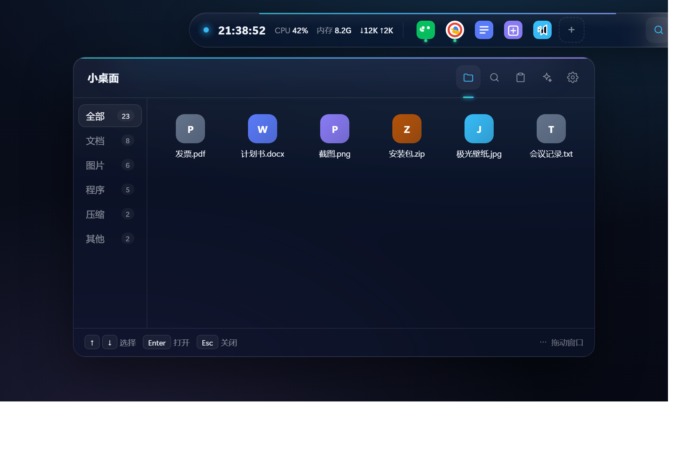
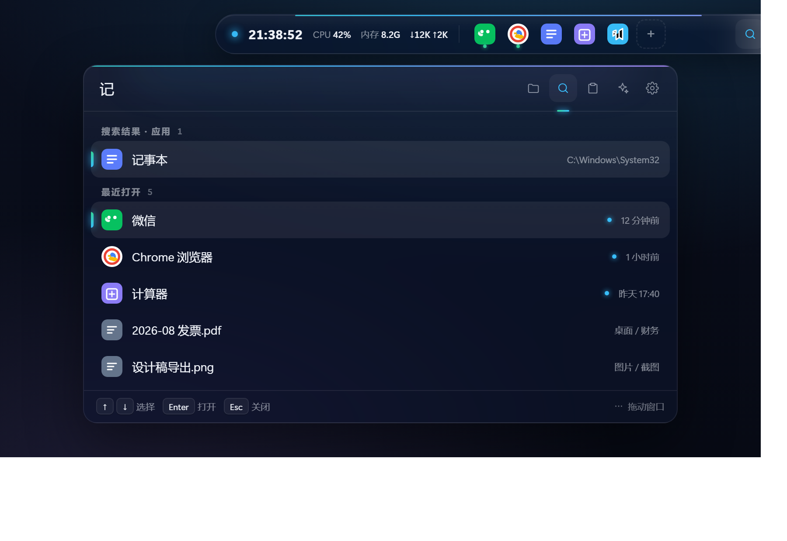
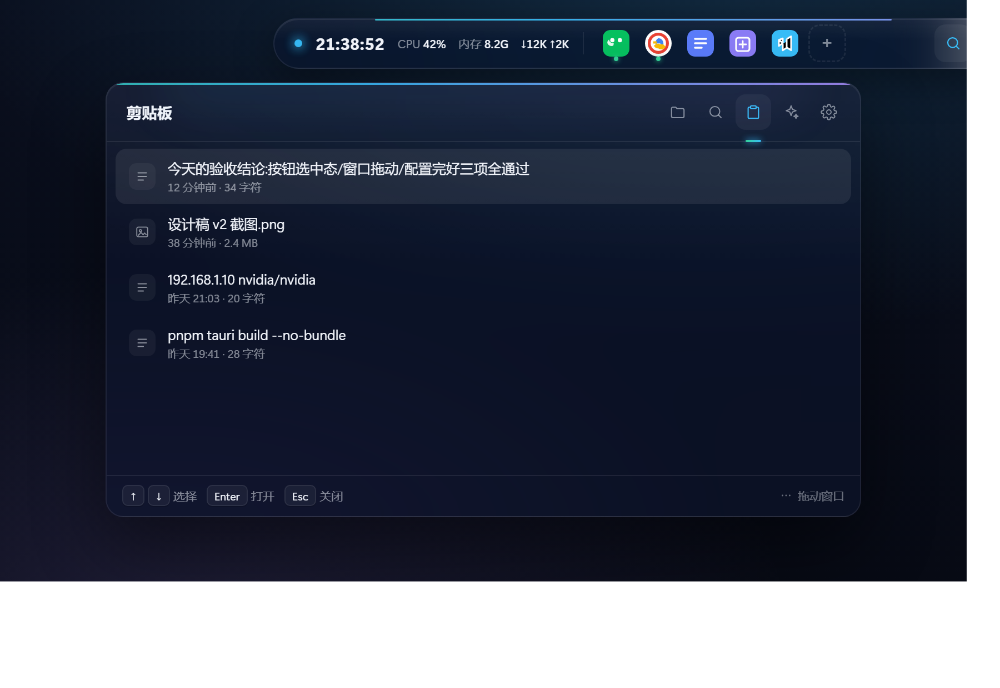
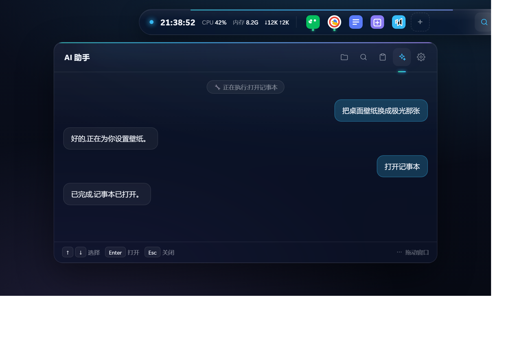
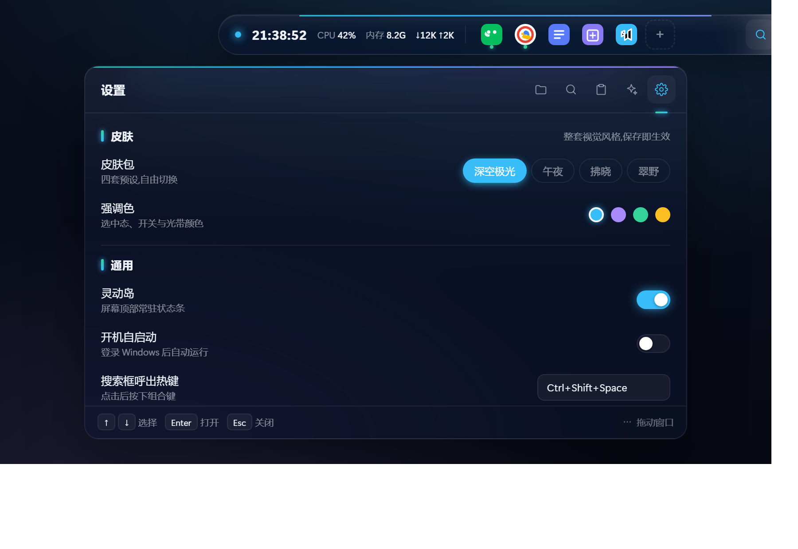
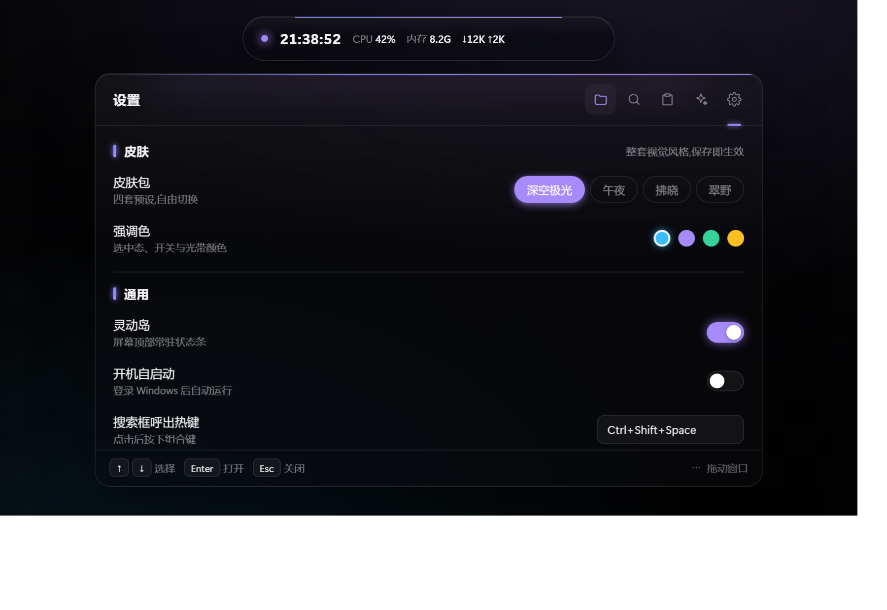
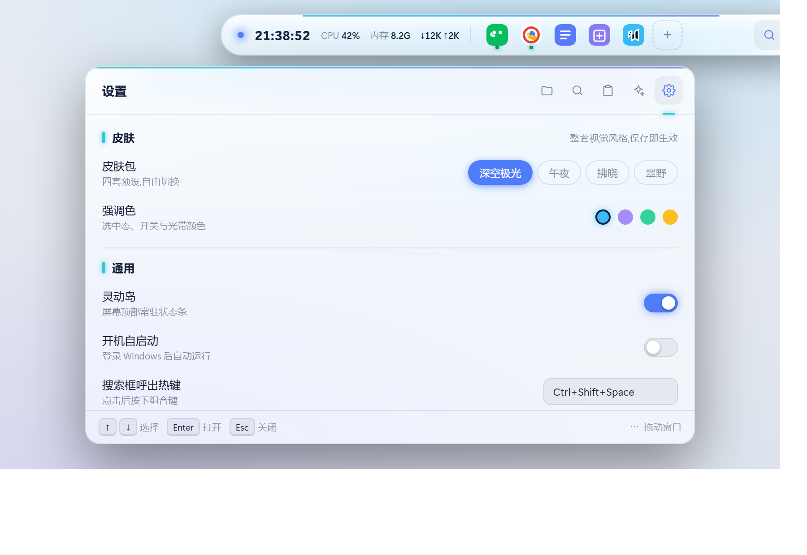
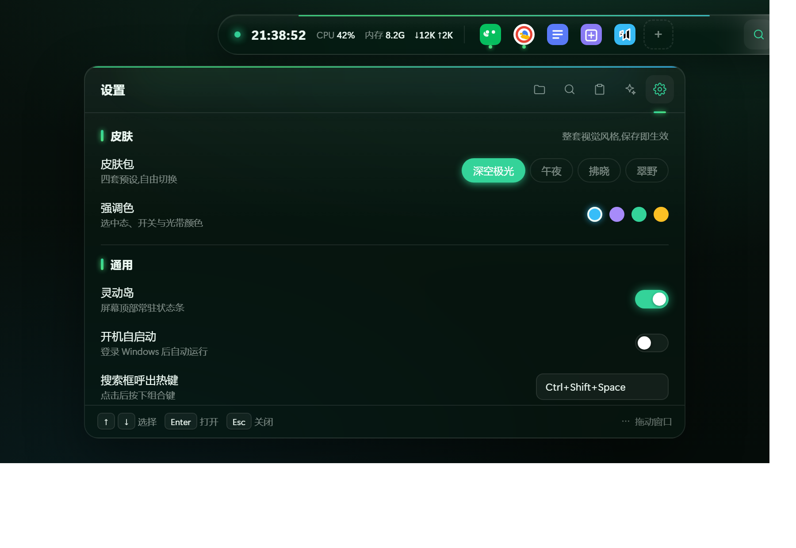

# Aurora

[English](./README.md) | [中文](./README.zh-CN.md)

> **The desktop universe beneath an aurora.**
> A floating aurora band at the top of your screen, holding an entire Windows desktop productivity universe.

Aurora is an open-source desktop productivity hub for Windows 10/11. The **Island** — a persistent pill at the top of your screen — is the single entry point: click to expand its **Dock** for quick launches, double-click to summon the **main panel** — five views (small desktop / search / clipboard / AI / settings) in one window. Every module is independently toggleable — turn off what you don't need, keep what you do.

## 📸 Screenshots

The Island (collapsed / expanded with Dock) and the main panel's five views:

| Island | Small Desktop | Search | Clipboard | AI |
|---|---|---|---|---|
|  |  |  |  |  |

Settings, and the four skin packs:

| Settings (Deep Space) | Midnight | Dawn | Verdant |
|---|---|---|---|
|  |  |  |  |

> Screenshots are rendered from the [interactive UI preview](./docs/aurora-v02-preview.html) (`tools/screenshot-preview.ps1`), so they stay in sync with the design.

## ✨ Highlights

- **🌌 Island (pill form)** — Persistent pill at the top of your screen: time, CPU, memory, network at a glance; **single-click expands the pill to reveal the Dock** (real icons / running dots / hover-to-remove / drag-to-add), one click to launch; draggable anywhere, the main panel follows
- **🪟 One-Island-One-Panel** — Double-click the Island (or press `Ctrl+Shift+Space`) to summon the main panel right below it: small desktop (default) / search / clipboard / AI / settings in one window; **just type to search** — search is an action, not a screen
- **📁 Small Desktop (file drawer)** — Desktop files auto-sorted by type, refreshed on change — a tidy desktop, always
- **⚡ Global Search** — Pinyin-aware matching for Chinese apps (`jsq` → 计算器), app + file result groups, smartly pinned recents, Enter to go
- **📋 Clipboard History** — Every copy auto-recorded, searchable, one-click re-paste, per-item delete, persisted across reboots
- **🤖 AI Assistant** — Dual mode: cloud DeepSeek + local Ollama; drive your system with natural language — open apps, find files, switch wallpapers; dangerous actions ask first
- **🖼️ Dynamic Wallpapers** — Video injected beneath the desktop; auto-downshift on battery; hot-plug multi-monitor rebuild; per-monitor wallpapers
- **🎨 4 Skin Packs + Aurora Edge** — Deep-space / Midnight / Dawn / Verdant in one click, 4 accent colors; every panel carries a flowing aurora light band along its top edge (the signature visual); applies to every window instantly on save
- **🔄 Auto Update** — In-app check, download, one-click upgrade with SHA-256 verification
- **🔒 Private & Light** — No telemetry; API keys stored locally only; idle memory under 120MB; zero background waste
- **🚀 Daily Driver Ready** — Start with Windows, first-run onboarding, one-click config export/import, crash logs for support, atomic config writes

## 💻 System Requirements

| Item | Requirement |
|---|---|
| OS | Windows 10 21H2 or later (64-bit) |
| Architecture | x64 |
| RAM | 4GB+ recommended (idle footprint <120MB); 8GB+ if running local AI models |
| Disk | Installer ≈5MB (NSIS) / ≈7MB (MSI) |
| GPU | No dedicated GPU required (glass blur & dynamic wallpapers run on iGPUs) |
| AI features (optional) | A DeepSeek API key, or a local Ollama service |

## 🚀 Quick Start

1. Download the installer from [Releases](https://github.com/sssst1118/aurora-desktop/releases) (`Aurora_0.2.4_x64-setup.exe` recommended, or `Aurora_0.2.4_x64_en-US.msi`)
2. Install and launch Aurora
3. Press `Ctrl+Shift+Space` (or double-click the Island) to summon the main panel and start

> The installer is not code-signed yet — if SmartScreen warns, choose *More info → Run anyway*. Auto-updates are still protected by SHA-256 verification.

**Optional AI setup**: the AI Assistant is enabled by default, but needs a key to respond — Settings → AI Assistant → enter your DeepSeek API key, or point to a local Ollama (e.g. `qwen2.5:7b-instruct-q4_K_M`) — switch freely between cloud and local.

**Curious how it looks?** Open the [interactive UI preview](./docs/aurora-v02-preview.html) — no install needed.

## ⌨️ Shortcuts

| Shortcut | Action |
|---|---|
| `Ctrl+Shift+Space` | Summon main panel (small desktop) |
| `Ctrl+Alt+D` | Summon main panel at small desktop |
| `Ctrl+Alt+V` | Summon main panel at clipboard |
| `Ctrl+Alt+A` | Summon main panel at AI assistant |
| `Ctrl+Shift+H` | Show / hide all windows |
| Click Island | Expand / collapse the Dock |
| Double-click Island | Summon main panel |

> Note: all modules (Dock / drawer / clipboard / AI / wallpapers) are **on by default** — turn off what you don't need in Settings, and their hotkeys deactivate with the module. The three `Ctrl+Alt+*` hotkeys can be re-assigned in Settings.

## 🛠️ For Developers

- **Shell**: Tauri 2 (multi-window, transparent frameless, tray, permission allowlist)
- **Backend**: Rust + native Win32 APIs — system calls, search indexing, and the AI proxy all live here
- **Frontend**: Vue3 + TypeScript + Vite + TailwindCSS
- Dev / packaging docs: [docs/开发文档.md](./docs/开发文档.md) · module details & roadmap: [docs/开发进度.md](./docs/开发进度.md)

## 📜 Design Principles

- Modular and toggleable — no bloat
- The frontend only renders; the heavy lifting stays in the Rust backend
- Idle memory under 120MB, zero background polling storms
- Every setting takes effect the moment you save it — no restarts
- AI keys live in local config only — never in the frontend, never on the network

## ❓ FAQ

- **Hotkey doesn't respond?** It may be taken by another app — rebind it in Settings.
- **SmartScreen warning?** The installer is not code-signed yet; choose *More info → Run anyway*. Updates are SHA-256 verified.
- **Where is my data?** Everything lives under `%APPDATA%\com.aurora.desktop\` — config.json, clipboard.json, and `logs\` (crash logs: `panic-*.log`).

## 📬 Feedback

Found a bug or want a feature? Open an [issue](https://github.com/sssst1118/aurora-desktop/issues) — attach the latest `panic-*.log` from the logs folder if it's a crash.

## Credits

Architecture and ideas inspired by Lively Wallpaper, Seelen-UI, Flow Launcher, Wox, EcoPaste, and other great open-source projects.

## License

[MIT](./LICENSE) © 2026 [sssst1118](https://github.com/sssst1118)
